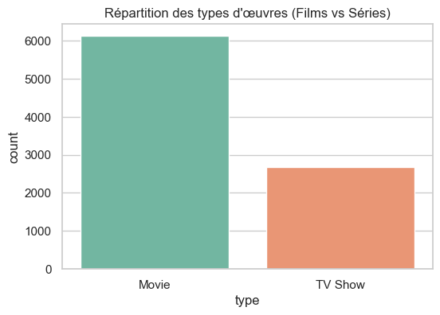
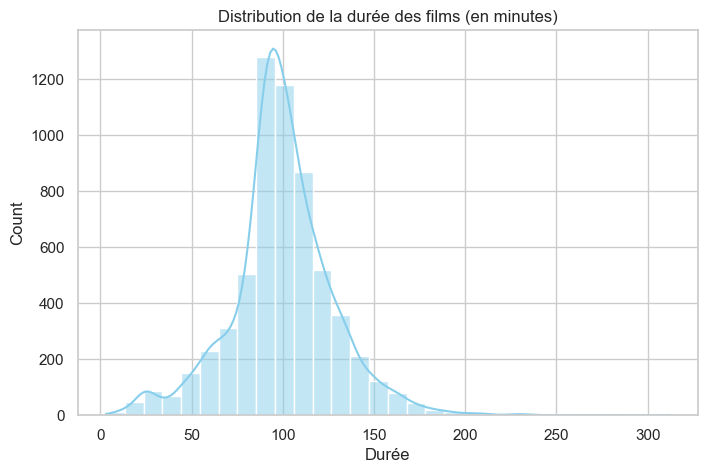
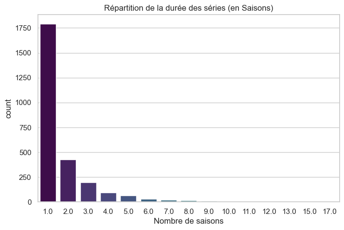
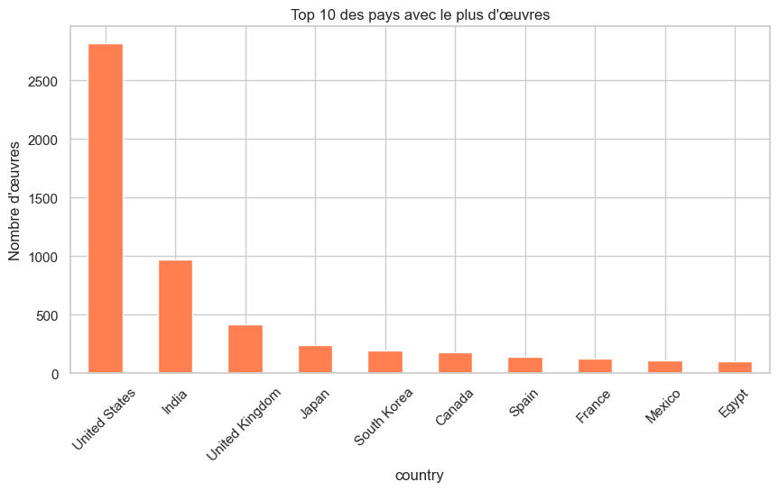
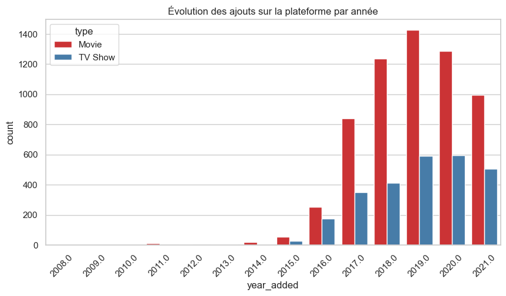
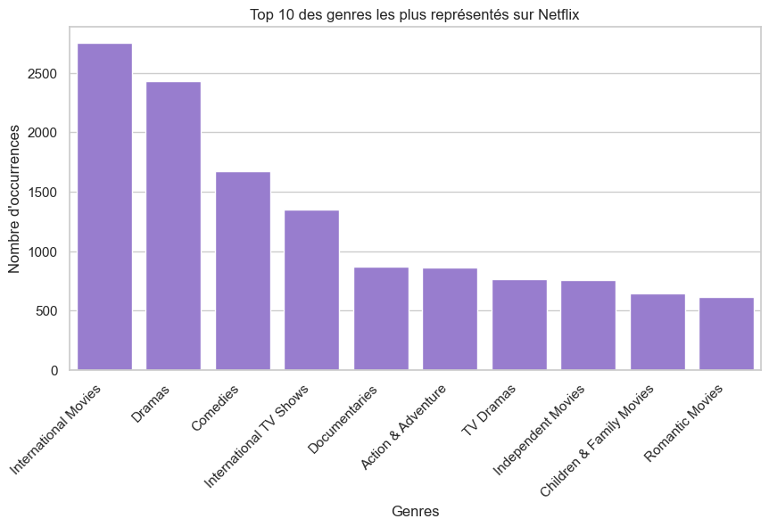

# 🍿 Netflix Insights : Analyse de Données & Dashboard Interactif

Bienvenue dans le projet **Netflix Insights**. Ce projet a pour but d'analyser le catalogue d'œuvres (Films et Séries) disponibles sur Netflix afin d'en extraire des tendances clés : répartition géographique, évolution temporelle des ajouts, et distribution des formats.

Initialement conçu comme une analyse exploratoire classique (Jupyter Notebook), ce projet a été poussé plus loin avec la création d'un **Dashboard Web interactif**.

---
<p align="center">
  
  
  
  
  
  
  
</p>

## 🛠️ Technologies Utilisées & Outils

* **Langage :** Python 3
* **Environnement de travail :** Jupyter Notebook (pour l'EDA) & VSCode (pour le Dashboard)
* **Nettoyage & Manipulation des données :** Pandas, NumPy, Missingno
* **Visualisation statique :** Matplotlib, Seaborn
* **Visualisation interactive :** Plotly Express
* **Création d'application Web :** Streamlit
* **Versionnement :** Git & GitHub

## Veille Technologique : Jupyter Notebook

### Qu'est-ce que Jupyter Notebook ?

**Jupyter Notebook** est un environnement interactif web open-source permettant :

- Exécution de code Python/R ligne par ligne
- Mélange de code, texte (Markdown), visualisations et outputs
- Documentation inline et reproductibilité
- Partage et collaboration simplifiés

### Évolution et tendances (2024-2025)

1. **Jupyter dans l'IA/ML** : Standard de facto pour l'exploration de données et l'entraînement de modèles
2. **JupyterHub & JupyterLab** : Versions multi-utilisateurs et interfaces améliorées
3. **Notebooks interactifs** : Avènement de technologies comme Quarto, Jupyter Book pour publications scientifiques
4. **Intégration CI/CD** : Validation et test automatisés des notebooks
5. **Limitations connues** : Gestion des versions difficile (GitHub diffs en JSON), problèmes de reproductibilité

### Utilité pour l'analyse de données

Jupyter est l'outil de choix pour :

- **EDA (Exploratory Data Analysis)** : Rapidité d'itération
- **Documentation interactive** : Code + explications
- **Communication de résultats** : Présentations professionnelles
- **Apprentissage** : Format pédagogique naturel

## 📌 Contexte du projet

Ce projet consiste en une analyse exploratoire de données (EDA) du catalogue Netflix. L'objectif est de nettoyer, transformer et analyser un jeu de données contenant les films et séries de la plateforme afin d'en extraire des tendances (types de contenus, pays producteurs, évolution des ajouts, etc.).

## 🚀 Installation & Exécution

1. Clonez ce dépôt sur votre machine locale :

   ```bash
   git clone [https://github.com/TonPseudo/Netflix-Data-Analysis.git](https://github.com/TonPseudo/Netflix-Data-Analysis.git)
   cd Netflix-Data-Analysis
   ```

2. Assurez-vous d'avoir les dépendances requises installées :

  ```bash
  pip install pandas numpy matplotlib seaborn missingno plotly streamlit
  ```

3. Lancez Jupyter Notebook et ouvrez le fichier d'analyse :

   ```bash
   jupyter notebook NetflixDataAnalysis.ipynb
   ```

4. Pour lancer le Dashboard interactif (Streamlit), placez-vous dans le dossier du projet et exécutez :

   ```bash
   streamlit run app.py
   ```

   Une fenêtre s'ouvrira automatiquement dans votre navigateur (généralement sur http://localhost:8501).

## 📊 Principaux Résultats & Visualisations

Suite au nettoyage des données (traitement des valeurs manquantes, formatage des dates et durées), plusieurs axes ont été explorés.
1. Répartition du type de contenu

Le catalogue est historiquement et majoritairement orienté vers les formats longs (Films) au détriment des Séries.
2. Évolution des ajouts sur la plateforme

On observe une croissance exponentielle des ajouts au catalogue à partir de 2017/2018, marquant le changement de stratégie de Netflix vers la production de contenu original.
3. Top des pays producteurs

Les États-Unis et l'Inde dominent largement la production des œuvres présentes sur la plateforme.

## 📂 Structure du projet
```text
📦 Netflix-Data-Analysis
 ┣ 📜 NetflixDataAnalysis.ipynb  # Notebook principal contenant l'EDA
 ┣ 📜 netflix_titles.csv         # Dataset original
 ┣ 📜 data_processing.py         # Script contenant les fonctions de nettoyage, de traitement des                                          valeurs manquantes et de *Feature Engineering* (extraction                                              d'années, calcul de délais, séparation des genres).
 ┣ 📜 app.py                     # Application Web Streamlit générant le tableau de bord interactif.
 ┣ 📜 README.md                  # Documentation du projet
 ┗ 📂 Assets
   ┗ 📂 Images
     ┣ 🖼️ evolution_ajouts.png
     ┣ 🖼️ repartition_duree_films.png
     ┣ 🖼️ repartition_duree_series.png
     ┣ 🖼️ repartition_type.png
     ┣ 🖼️ top_genres.png
     ┗ 🖼️ top-10_pays.png
```

---

## 🌟 Fonctionnalités & Bonus

En plus des consignes analytiques de base, ce projet intègre plusieurs fonctionnalités avancées :
1. **Feature Engineering sur les genres :** Nettoyage et séparation (explode) de la colonne `listed_in` pour isoler et compter individuellement chaque genre.
2. **Dataviz Interactive (Plotly) :** Remplacement des graphiques statiques par des versions survolables et dynamiques dans l'application web.
3. **Application Streamlit :** Mise en production locale de l'analyse via un dashboard structuré (KPIs globaux, onglets de navigation, design compatible Dark Mode).

---

## 📊 Aperçu des Analyses (Graphiques Statiques)

Voici un aperçu des visuels générés lors de la phase exploratoire avec Matplotlib et Seaborn :

### 1. Répartition et Formats
*La majorité du catalogue historique est composée de films, dont la durée moyenne se situe autour de 90 à 110 minutes.*
<p align="center">
  
  
</p>

### 2. Formats des Séries
*Les séries sur Netflix dépassent rarement la première saison, témoignant d'un renouvellement rapide du catalogue et de l'essor des mini-séries.*
<p align="center">
  
</p>

### 3. Géographie et Évolution
*Les États-Unis dominent la production, suivis par l'Inde. On observe une croissance exponentielle des ajouts jusqu'en 2019.*
<p align="center">
  
  
</p>

### 4. Top Genres (Bonus)
<p align="center">
  
</p>

---
